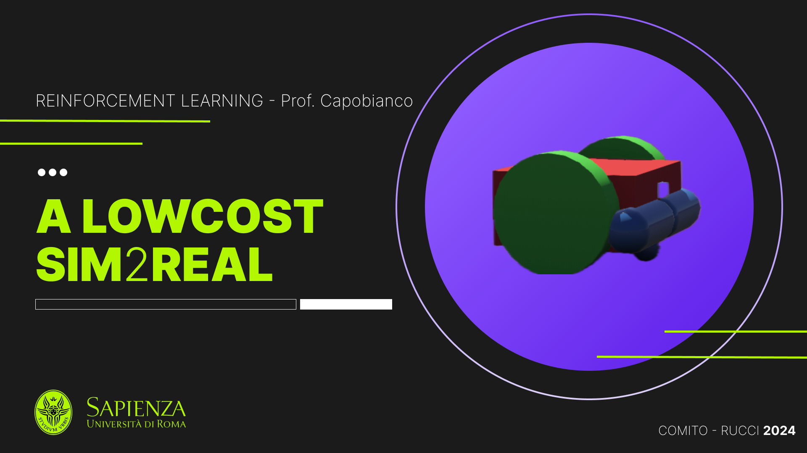
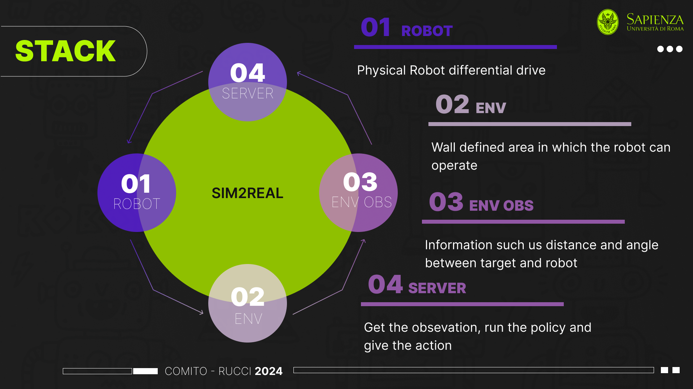

# Reinforcement Learning for Differential Drive Robot - Exam Project
Project developed by me and @ludocomito for the exam of Reinforcement Learning.

<!-- Image Cover.png-->

  

## Project Description
The project has been developed in order to test a method to perform sim2real for a differential drive robot.
The Paper that has been used as reference is [Deep Reinforcement Learning With Action Masking for Differential-Drive Robot Navigation Using Low-Cost Sensors] (pdf in the repo).

## Advice
In order to understand all the steps of the project, it is recommended to take a look to the PDF presentation in the repo.

It contains a description of the problem, the stack used, the architecture of the different pieces of the project and the results obtained.

Regarding the results, it is possible to look at the videos at the following links:
- [Successes] https://www.youtube.com/watch?v=4ErhxFbHwZM&ab_channel=EmanueleRucci
- [Failures] https://www.youtube.com/watch?v=ATno2D7XG1U&ab_channel=EmanueleRucci

## Run the project
The project is composed by 3 main parts: look at the following image

  

The folder client_server contains
- complete_server.py (the file that runs the policy network)
- with_angle.py (the file that shows the angle and the distance between robot and target) using pupil_apriltags

The folder develop_3 contains
- raspberry.py (the file that runs the client on the raspberry) -> responsible of the communication with the server and with arduino and reading the sensors
- Arduino folder (the folder that contains the code for the arduino) -> the .h and .ino files

The repo contains also a fritzing file that shows the connections between the raspberry and the arduino.
